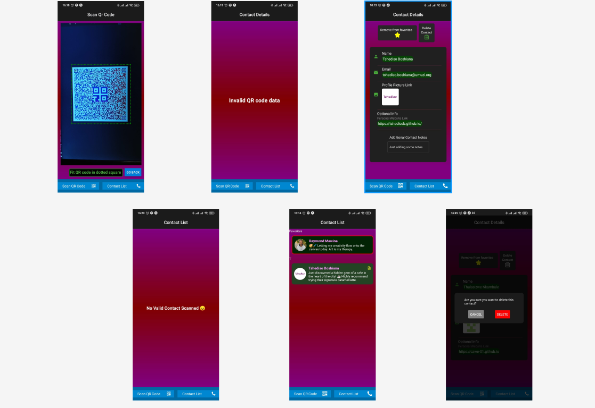

# Project Showcase: `QR conference connector`

# How to install and run the project
In the project directory, you can run:
### `npm install`
### `npx expo start`
If having issues you can try:
### `npx expo start --tunnel`

## Overview

This is a mobile application that scans the QR code of a conference attendee and retrieves their contact details. The application also allows adding notes, favorite status, and deleting the contact.

## Technologies Used

- **React Native:** A JavaScript library for building mobile user interfaces.
- **CSS:** Custom styling for the overall appearance.
- **Sqllite** For storing the contacts database.
- **Redux** For state management.
- **Jest** For testing the project.
- **Expo** To access native APIs, build and deploy the app.

## Contact

For any inquiries or questions, feel free to reach out to Tshediso at [tshedisoboshiana@gmail.com](mailto:tshedisoboshiana@gmail.com).

Other projects can be found at [projects](https://projects-5584f.web.app/)

Happy exploring! 🚀